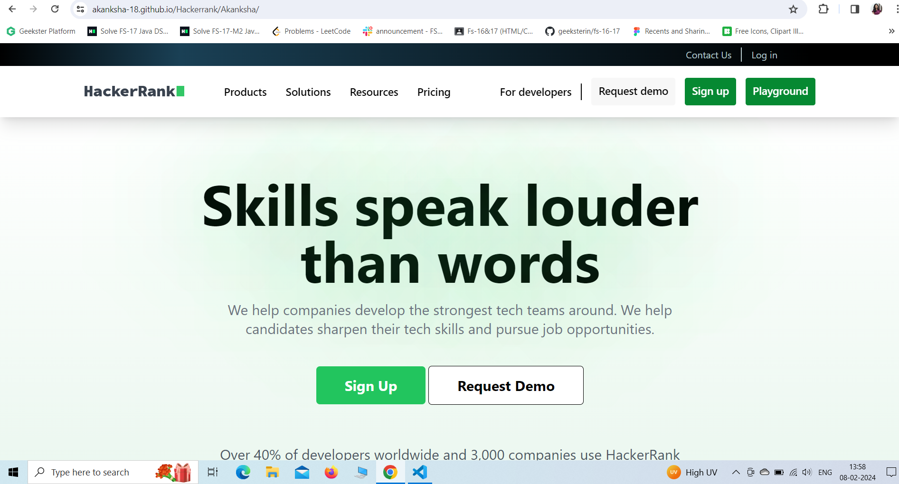
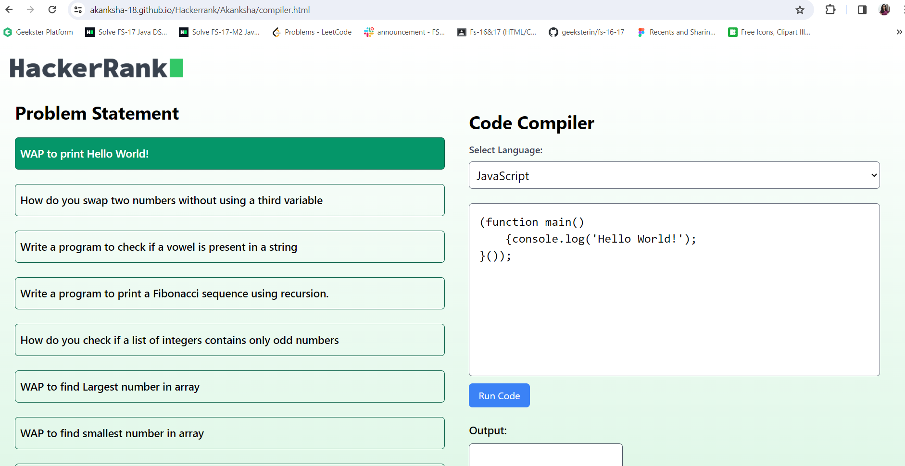
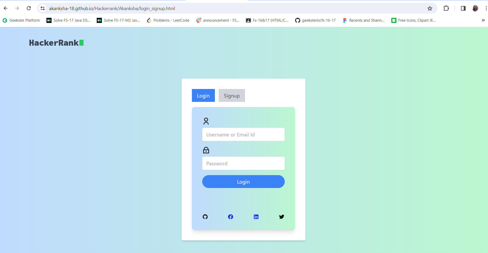
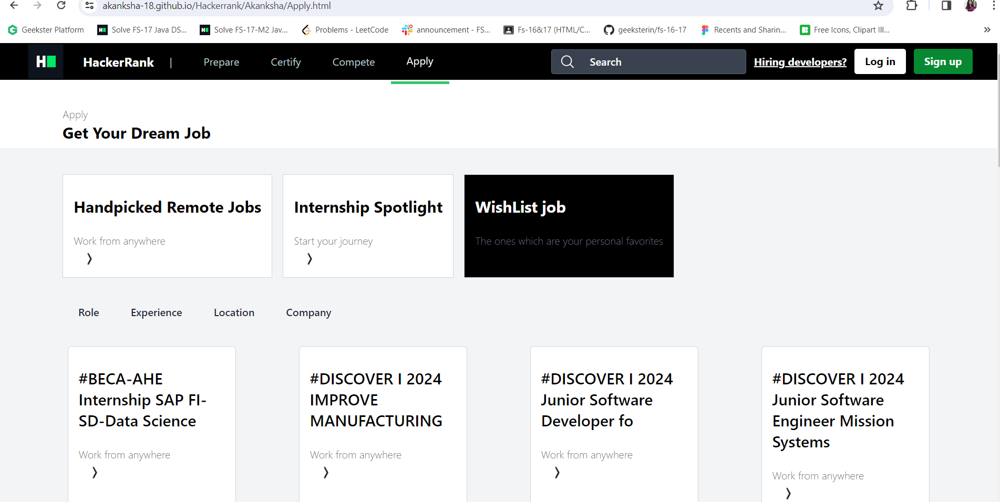
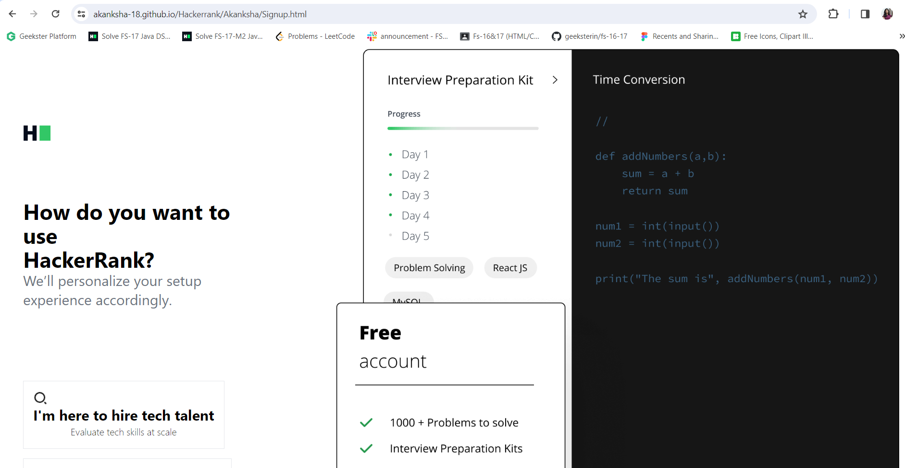

# HackerRank Website Clone

Welcome to my HackerRank clone project! This web development endeavor is my interpretation of the renowned coding platform, HackerRank. The goal was to recreate the essence of HackerRank's user interface and core functionalities while incorporating my own design elements.

---
## Hosted Link : [Link](https://akanksha-18.github.io/Hackerrank/Akanksha/)

## Table of Contents :-
1.[Introduction]()
2.[My Work]()
3.[Technologies Used]()
4.[UI Design]()

---
## Introduction:
Introducing our HackerRank clone: A platform designed to challenge and hone coding skills through a variety of programming exercises. Featuring a user-friendly interface, extensive problem sets, and real-time coding assessments, it's perfect for both beginners and seasoned developers alike. Dive into our community-driven platform to practice, learn, and compete, all while sharpening your coding prowess. Join us and embark on a journey of continuous improvement in the world of programming challenges.
---
## My Work:-
1. HomePage :-Dive into coding with our HackerRank clone homepage. I've carefully crafted an interface that's both smooth and engaging, inviting coders of all levels. Whether you're starting out or a seasoned pro, our platform is your canvas for a seamless coding experience.

2. Playground Page:- This Playground page is a extra feature that i added in hackerrank clone.

3. Login_SignUp Page:-Discover the thoughtfully designed Login and Sign Up pages. Dive in and experience the seamless blend of style and functionality.

4. Apply Page:- Explore the functionality of Apply Page and take experience to dive in to that styling.

5. Home SignUp Page:-Discover and experience Signup page.I haven't just created a page, I've crafted a gateway to an experiential world.
---

---

## Technologies Used: 
1. **HTML:**
- Used for structuring the web pages including headers, navigation bars, content sections, and footers.
2. **CSS (including Tailwind CSS):**
- Applied for styling and layout.
- Tailwind CSS: used for framework for rapid UI development, implementing responsive design and styling components efficiently.
3. **JavaScript:**
- JavaScript Libraries Used : Our HackerRank Clone Website Project relies on several external libraries and dependencies to enhance its functionality and features. Below is a list of these libraries along with their purposes:
4. **Flickity-v2**
- Description: Flickity is a modern and highly flexible JavaScript library designed for creating responsive, touch-friendly sliders and carousels on websites and web applications.
- Usage: It is used to implement some touch, responsive, flickable carousels and enhance the functionality of our website.
Documentation: [Official documentation for reference.]()
5. **Font Awesome** and **Heroicons** (for icons)
- Description: Font Awesome is a comprehensive icon library that offers a vast selection of icons for various purposes, such as user interface design, web development and graphic design.
- Usage:
  - Include the CSS: Add the Font Awesome CSS stylesheet to your HTML     document by including a link in the section.
  - Add Icons: Insert icons into your HTML using the element with the appropriate class. Customize their appearance using CSS.
  - Customize Icons: You can modify icons' size, color, and alignment by adding extra classes and applying CSS styles.
  - Explore Icons: Visit the Font Awesome website or documentation to find the icons that suit your project's needs.
  - Documentation: [Official documentation for further details.]()
6. Google Fonts and Material Icons (For fonts and icons)
- Description: Google Fonts is a diverse collection of free, open-source fonts, perfect for enhancing the typographic appeal of websites and applications. Material Icons, part of the Material Design system, offers scalable vector icons for versatile UI elements.
- Usage:
1. Embed Fonts: Integrate Google Fonts by adding the stylesheet link to your HTML's . Apply desired font styles in your CSS using the specified font-family.
2. Apply Fonts: Customize your project's typography by applying selected Google Fonts styles to HTML elements.
3. Customize Icons: You can modify icons' size, color, and alignment by adding extra classes and applying CSS styles.
4. Responsive Design: Leverage the scalability of vector icons, ensuring adaptability across various screen sizes without compromising quality.
5. Explore Icons: Visit the Font Awesome website or documentation to find the icons that suit your project's needs.
6. Documentation: [Official documentation for further details.]()

7. **AOS**
   -Description : AOS is a Animation On Scroll library that offers an animation-providing JavaScript library that makes it easier to add tons of animations by simply changing the name of the class in the div tag in which you want to add an animation. While there are different animation JavaScript libraries out there, AOS. [Link](https://michalsnik.github.io/aos/)
---

## CONCLUSION
---
Our HackerRank clone project was a challenging yet enriching journey in web development. We honed our skills in HTML, Tailwind CSS, and JavaScript, crafting a responsive design. The experience deepened our problem-solving abilities and lays the foundation for future projects and improvements.
---
***Achievements***
 - Faithful Representation: We have strived to provide a faithful representation of the HackerRank website, mirroring its visual aesthetics, layout, and key functionalities.
 - Learning and Skill Development: This project has been a valuable learning experience in web development. <<<<<<< HEAD
We've honed our skills in HTML, CSS, and the Tailwind CSS framework, allowing us to create responsive and visually appealing web pages.
 - Portfolio Enhancement: The HackerRank project serves as a testament to our web development abilities, providing a meaningful addition to our portfolios.
 - We've honed our skills in HTML, CSS, and the Tailwind CSS framework, allowing us to create responsive and visually appealing web pages.
